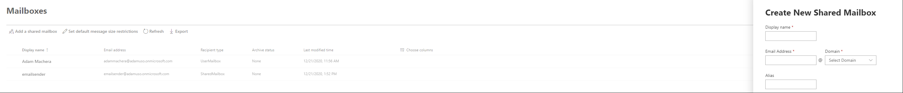
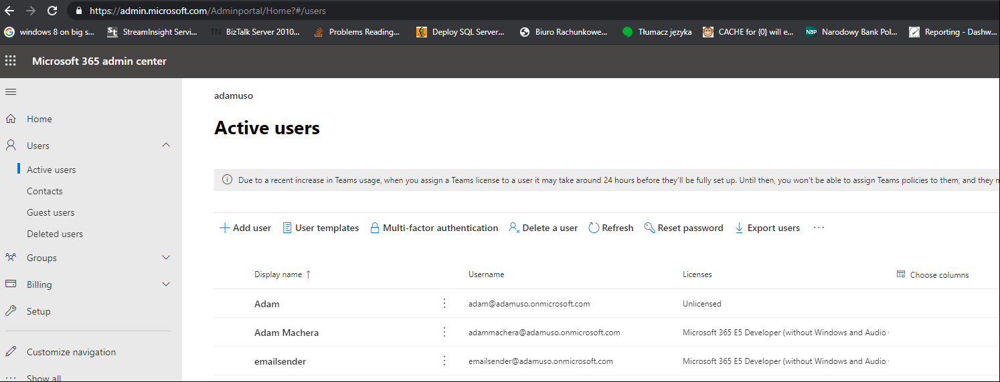
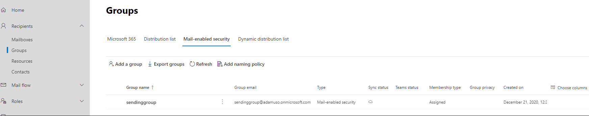
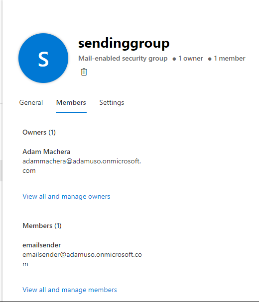
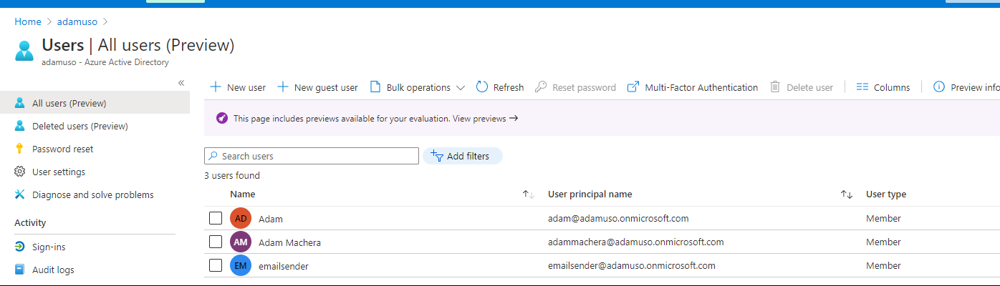
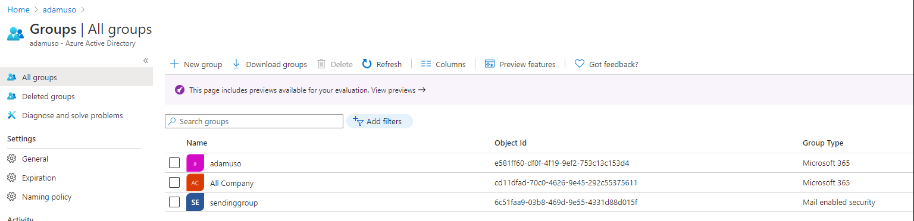
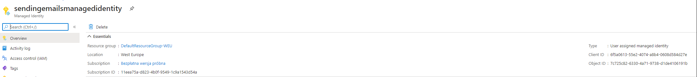
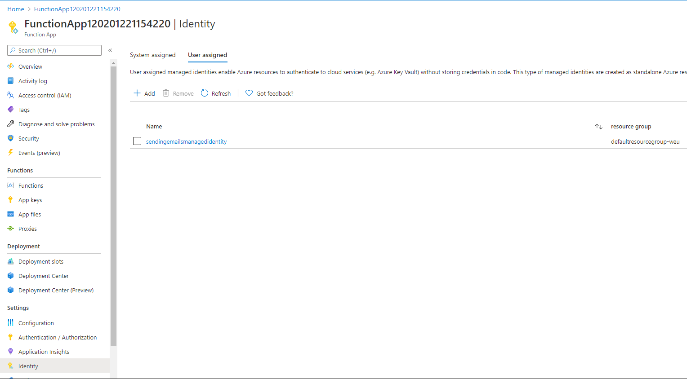
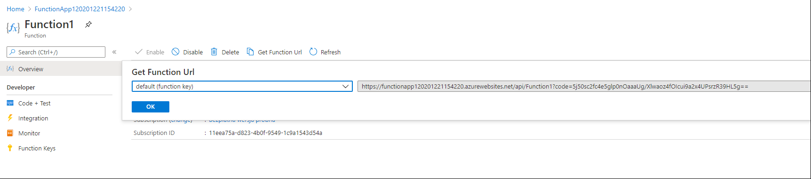
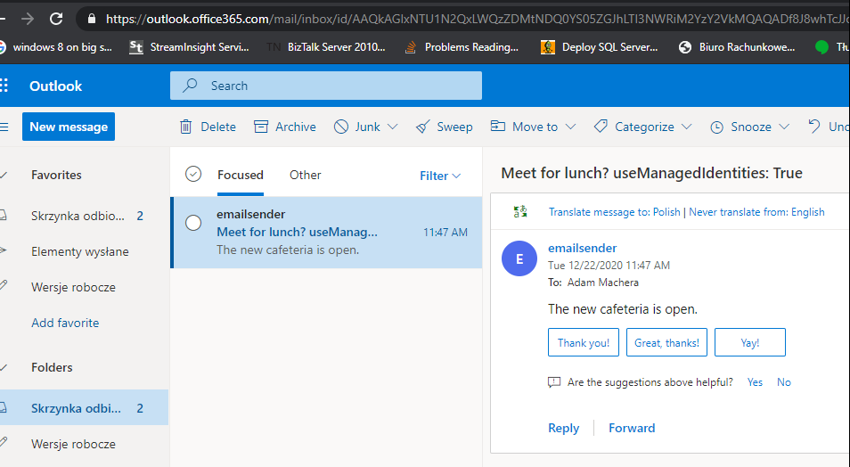

## How to send emails from azure functions using user managed identities and graph API
This is tutorial describing how to send emails from shared mailbox using azure function running with user assign managed identity.
Using managed identities eliminates necessity to store service principal client secret.

### Steps

### 1. Create office 365 tenant 
[Subscribe](https://portal.office.com/Signup?OfferId=B07A1127-DE83-4a6d-9F85-2C104BDAE8B4&dl=ENTERPRISEPACK&ali=1)

I have created organization adamuso
### 2. Create shared mailbox [here](https://admin.exchange.microsoft.com/)


I have created emailsender@adamuso.onmicrosoft.com


### 3. Assign license for shared mailbox
It can work with office 365 it can be done [here] (https://admin.microsoft.com/Adminportal/Home#/users)


### 4. Create mail enabled security group


I have created sendinggroup@adamuso.onmicrosoft.com

###	5. Add sharedmailbox as a member of newly created mail enabled security group


In my case I have added emailsender@adamuso.onmicrosoft.com as a member to sendinggroup@adamuso.onmicrosoft.com

###	6. Take a coffee break
It takes around 1 hour to have office365 be synchronized with azure AD. 
Data in azure portal will be presented earlier but if you don't wait you might see exception when running code: 
"Code: ErrorAccessDenied\r\nMessage: Access to OData is disabled."

To check if office 365 was synchronized with azure AD go to porta.azure.com.
Open Azure AD and under Users and Groups tab you should see






###	7. Create resource group 
At portal.azure.com create resource group (In my case it is called DefaultResourceGroup-WEU)

### 8. Create managed identity
In the above resource group create managed identity (mine was named sendingemailsmanagedidentity)



Most important thing is to take the Client Id - (6f5a0613-55e2-4074-a8b4-0608d584d27e) - because it is going to be used to scope access for this identity to exchange mail enabled security group.

### 9. Exchange online scoping

Install ExchageOnlineManagement by opening Windows Powershell ISE as administration
```markdown
Install-Module -Name ExchangeOnlineManagement -RequiredVersion 2.0.3
Import-Module ExchangeOnlineManagement
Connect-ExchangeOnline -UserPrincipalName adammachera@adamuso.onmicrosoft.com -ShowProgress $true (where user principal name has to have administrator permissions)
New-ApplicationAccessPolicy -AppId 6f5a0613-55e2-4074-a8b4-0608d584d27e -PolicyScopeGroupId sendinggroup@adamuso.onmicrosoft.com -AccessRight RestrictAccess -Description "Restrict this app to members of distribution group EvenUsers." 

#We can test to see if managed identity has access to sharedmailbox
Test-ApplicationAccessPolicy -Identity emailsender@adamuso.onmicrosoft.com -AppId 6f5a0613-55e2-4074-a8b4-0608d584d27e

RunspaceId        : c8969a2c-9051-481a-9ff9-b53f53e83c6e
AppId             : 6f5a0613-55e2-4074-a8b4-0608d584d27e
Mailbox           : emailsender
MailboxId         : 61b37157-e5e5-42cb-bd24-e1e8554cdb00
MailboxSid        : S-1-5-21-2743175707-3693921860-1054224328-18701846
AccessCheckResult : Granted

#If we try to access identity that managed identity has not been granted
Test-ApplicationAccessPolicy -Identity adammachera@adamuso.onmicrosoft.com -AppId 6f5a0613-55e2-4074-a8b4-0608d584d27e

RunspaceId        : c8969a2c-9051-481a-9ff9-b53f53e83c6e
AppId             : 6f5a0613-55e2-4074-a8b4-0608d584d27e
Mailbox           : adammachera
MailboxId         : 9709396d-5692-48ab-a0f9-5cc3c9bff020
MailboxSid        : S-1-5-21-2743175707-3693921860-1054224328-18563018
AccessCheckResult : Denied
```

### 10. Assign azure ad permissions

We cannot use portal.azure.com UI because managed identities are not azure AD APP. They are service principals.
To be able to assign them Mail.Send Application permission in graph API we need to execute following scripts in the Windows Powershell ISE

```markdown
Install-Module AzureAD #just in case you are missing it

$TenantID="a8ba4850-e038-4970-a5e9-f545522b950a" #your tenant ID
$subscriptionID="11eea75a-d823-4b0f-9549-1c9a1543d54a" #your subscription id
$DisplayNameOfMSI="sendingemailsmanagedidentity" #name of managed identity

Connect-AzureAD -TenantId $TenantID #Connect as Global Administrator
$MSI = (Get-AzureADServicePrincipal -Filter "displayName eq '$DisplayNameOfMSI'")
Start-Sleep -Seconds 10
$MSGraphAppId = "00000003-0000-0000-c000-000000000000" #Microsoft Graph aka graph.microsoft.com, this is the
$GraphServicePrincipal = Get-AzureADServicePrincipal -Filter "appId eq '$MSGraphAppId'"
$PermissionName = "Mail.Send"
$AppRole = $GraphServicePrincipal.AppRoles | Where-Object {$_.Value -eq $PermissionName -and $_.AllowedMemberTypes -contains "Application"}
$AppRole
New-AzureAdServiceAppRoleAssignment -ObjectId $MSI.ObjectId -PrincipalId $MSI.ObjectId -ResourceId $GraphServicePrincipal.ObjectId -Id $AppRole.Id  
Get-AzureADServiceAppRoleAssignment -ObjectId $GraphServicePrincipal.ObjectId | Where-Object {$_.PrincipalDisplayName -eq $DisplayNameOfMSI} | fl

#After execution from last line you should see
DeletionTimestamp    : 
ObjectId             : glxyfDBjcUqXONHeQQYZG_DHQLSglopMlNOCMLMyVIo
ObjectType           : AppRoleAssignment
CreationTimestamp    : 12/21/2020 3:13:07 PM
Id                   : b633e1c5-b582-4048-a93e-9f11b44c7e96
PrincipalDisplayName : sendingemailsmanagedidentity
PrincipalId          : 7c725c82-6330-4a71-9738-d1de4106191b
PrincipalType        : ServicePrincipal
ResourceDisplayName  : Microsoft Graph
ResourceId           : d7ec4d30-b230-4d6f-ae37-5134e2aff55b
```

### 11. Create simple azure function in portal
Create azure function http trigger in c# core
```markdown
using System;
using System.Threading.Tasks;
using Microsoft.AspNetCore.Mvc;
using Microsoft.Azure.WebJobs;
using Microsoft.Azure.WebJobs.Extensions.Http;
using Microsoft.AspNetCore.Http;
using Microsoft.Extensions.Logging;
using Microsoft.Graph;
using System.Collections.Generic;
using Microsoft.Extensions.Configuration;
using System.Net.Http.Headers;
using Azure.Identity;

namespace FunctionApp1
{
    public static class Function1
    {
        [FunctionName("Function1")]
        public static async Task<IActionResult> Run(
            [HttpTrigger(AuthorizationLevel.Function, "get", "post", Route = null)] HttpRequest req,
            ILogger log)
        {
            log.LogInformation("C# HTTP trigger function processed a request.");

            var builder = new ConfigurationBuilder().SetBasePath(Environment.CurrentDirectory)
                .AddJsonFile("local.settings.json", optional: true, reloadOnChange: true)
                .AddEnvironmentVariables();
            var configuration = builder.Build();

            string managedIdentityClientId = null;
            try
            {
                managedIdentityClientId = configuration.GetValue<string>("MANAGED_IDENTITY_CLIENT_ID");
                log.LogInformation($"Send using Managed identity {managedIdentityClientId}");
                var managedIdentity = new ManagedIdentityCredential(managedIdentityClientId);
                var managedToken = await managedIdentity.GetTokenAsync(new Azure.Core.TokenRequestContext(new[] { "https://graph.microsoft.com/.default" }));
                log.LogInformation($"MI token {managedToken.Token}");
                var graphClient = new GraphServiceClient(
                    new DelegateAuthenticationProvider((requestMessage) =>
                    {
                        requestMessage
                        .Headers
                        .Authorization = new AuthenticationHeaderValue("bearer", managedToken.Token);

                        return Task.CompletedTask;
                    }));
                await SendMessageAsync(graphClient, true, log);
            }
            catch (Exception exmi)
            {
                log.LogError($"Problems while sending using managed identity {managedIdentityClientId} error: {exmi}");
                return new BadRequestObjectResult(exmi.ToString());
            }

            return new OkObjectResult("Emails were sent");
        }

        private static async Task SendMessageAsync(GraphServiceClient client, bool managedIdentity, ILogger log)
        {

            var message = new Message
            {
                Subject = $"Meet for lunch? useManagedIdentities: {managedIdentity}",
                From = new Recipient
                {
                    EmailAddress = new EmailAddress
                    {
                        Address = "emailsender@adamuso.onmicrosoft.com"
                    }
                },
                Body = new ItemBody
                {
                    ContentType = BodyType.Text,
                    Content = "The new cafeteria is open."
                },
                ToRecipients = new List<Recipient>()
                        {
                            new Recipient
                            {
                                EmailAddress = new EmailAddress
                                {
                                    Address = "adammachera@adamuso.onmicrosoft.com"
                                }
                            }
                        }
            };

            await client.Users["emailsender@adamuso.onmicrosoft.com"].SendMail(message)
                .Request()
                .PostAsync();
            log.LogInformation("Email was sent");
        }
    }
}
```

Publish this function to newly created azure function.
Go to this function app in portal.azure.com and go to Identity tab and add sendingemailsmanagedidentity managed identity



Once it is assigned go to function tab and click "Get Function Url"



Open [it](https://functionapp120201221154220.azurewebsites.net/api/Function1?code=5j50sc2fc4e5glp0nOaaaUg/Xlwaoz4fOIcui9a2x4UPsrzR39HL5g==) in browser

As result you will get operation result.
If operation was succesful email will be sent from emailsender@adamuso.onmicrosoft.com (shared mailbox)


